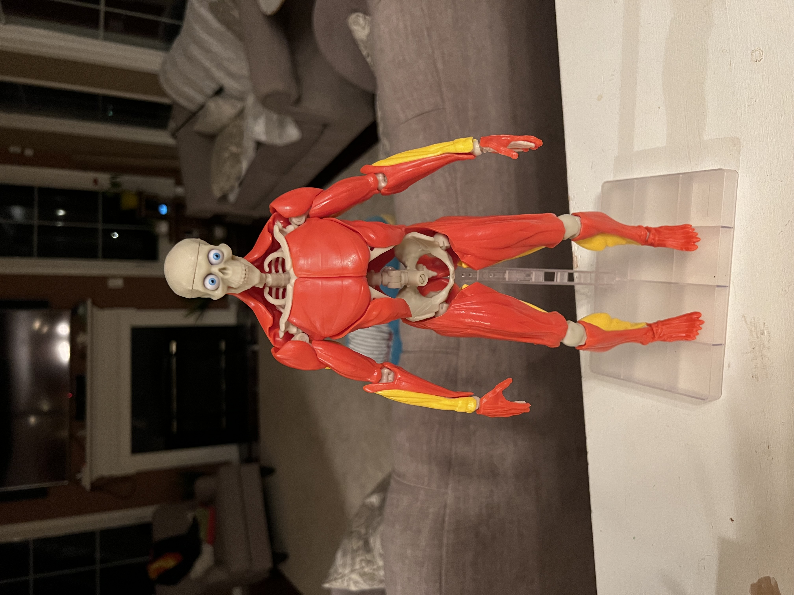

{}

Have fun completing this challenge based on what you've learned throughout the stations while competing against the other groups!
{.mt-5}

{}

{}

<!-- # This is another section -->

{}

1. Answer the questions on the game question worksheet. Each question that you get right is 5 seconds off your final time.
2. Empty out the bags and sort the pieces into bones and muscles (The muscles are red and yellow, and the bones are white)
3. Attach the spinal cord to the base. There is a ball on the spine and a socket on the top of the base.
4. Start a stopwatch on an iPad and start building the skeleton from the feet up. Attach the muscles to the bones as you go up.
5. When you finish subtract the time from the questions you got right and record your final time on the piece of paper.
6. **Have fun!**

{}

{.text-center}

{}