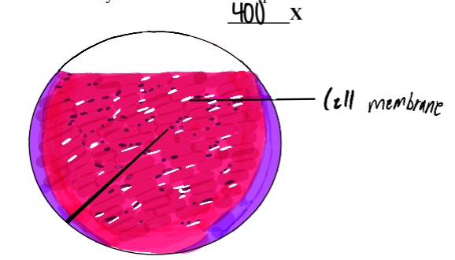

<!--add blocks of content here to add more sections to the community page -->

{}

What does the musculoskeletal system look like at a closer glance? How does this relate to the way it works?
{.mt-5}

{}

{}

<!-- # This is another section -->

{}

Skeletal muscle cells have a unique structure with multiple fibers and striations. The striations aid in the sliding filament theory of muscle contraction, contributing to the voluntary movement aspect of the musculoskeletal system. An element of these cells’ structure that contributes to their function is their connection to each other. The way they come together to form tissue with space between them makes them flexible and mobile enough to handle the constant stretching and contracting when moving the that they have to do in order to move the body with minimal tearing, which would lead to discomfort and require healing.
{}

{.text-center}

{}