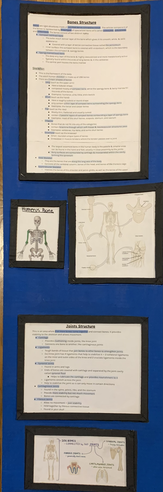
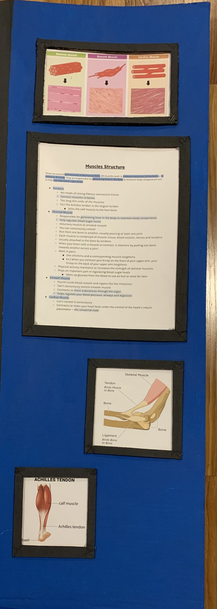
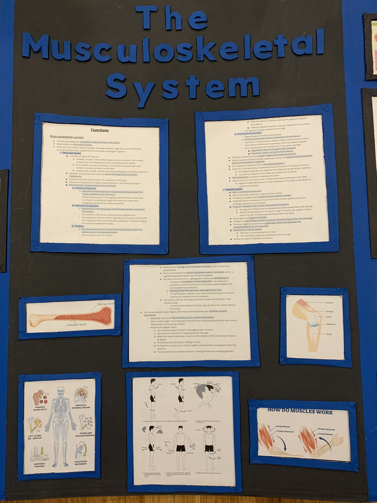

{}

Get a detailed overview of our entire system packed with visuals both on the trifold and around it.
{.mt-5}

{}

{}

<!-- # This is another section -->

{}

 
 <b>On The Left</b>: An in depth description and breakdown of the structure of the skeletal side of our system.

{}

{.text-center}

{}

{}

<!-- # This is another section -->

{}

 
 <b>On The Right</b>: An in depth description and breakdown of the structure of the muscular side of our system.

{}

{.text-center}

{}

{}

<!-- # This is another section -->

{}

 
 <b>In The Middle</b>: An in depth description and breakdown of the musculoskeletal system's job/function within the body.

{}

{.text-center}

{}